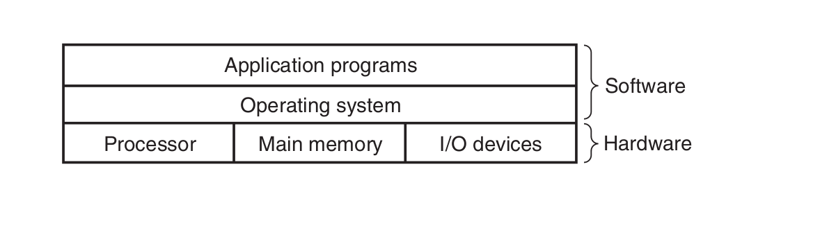
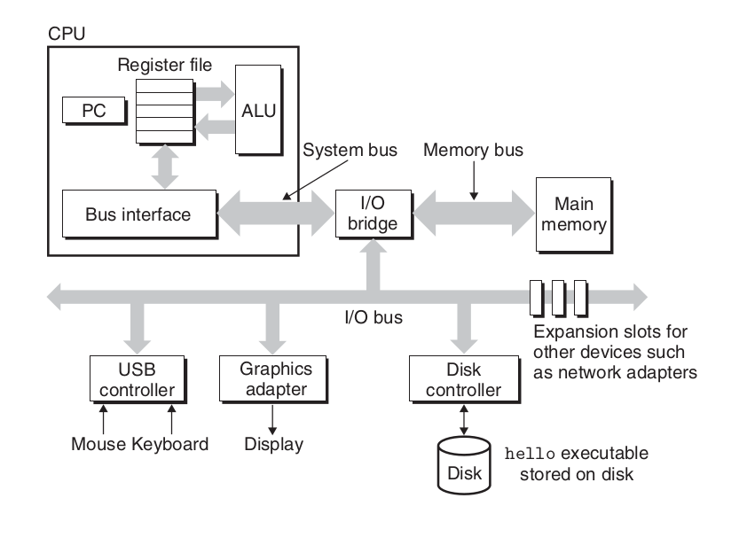
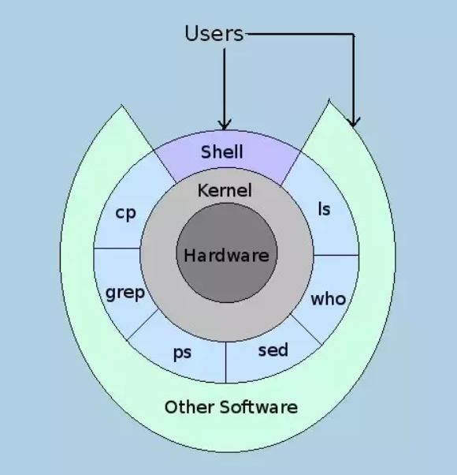

### Overview
1. Layered Architecture
2. Hardware overview of the system:  
	1. Buses  
	2. I/O devices  
	3. Main memory  
	4. Processor
4. GUI(Graphical user interface) vs CLI (Command line interface)

---
### Layered architecture

 

---
### Hardware overview



---
### Hardware overview(2)

**Buses** are like nervous system of the computer. Data moves from one place to another via buses. Buses are charecterized by word size as well as bits that can be transfered in a given time.

---
### Hardware overview(3)

**IO devices** are what connects a computer to external world. It"s like humans have 5 senses, computer has IO devices. 4 key IO devices that we will concern ourselves with are:   
	1. Display: out device through which computer talks back with the user.  
	2. Keyboard/mouse: input device through which computer listens to the user  
	4. Storage device: This is the long term storage that computer has. All programs initially lies here.   

---

### Hardware overview(4)
**Main memory** is the area where program is loaded when it is to be run and it stays there while it"s being executed. Think of it like short term memory in humans. Any task in ordered to be done should inside our memory.

---
### Hardware overview(5)
**Processor** is where results and addresses are computed in the program. It has 3 main parts:  
1. Program counter  
2. registers   
3. ALU(Arithmetic and Logical unit)   

---
### GUI vs CLI
Different ways to launch programs:
1. *via GUI*(Graphical User Interface)
	When you double click a program(like vlc), it"s `.desktop` file is referred (`/usr/share/applications`). From there OS knows which program is to be run in order to run that application.
2. via CLI (Command Line Interface) 
	OS provides user [[Shell]] which is a program that executes other programs in response to text input. Shell interprets and executes the command.
---

### Kernel and Shell(1)



---
### Kernel vs shell (2)
**[[Kernel]]** 
is the most important part of operating system that talks to hardware. It is loaded into main memory when the system is booted and resides there till it"s shutdown. 

**[[Shell]]** is the outer part of the operating system which is close to the user. It is the program that  interprets user"s text commands and execute them. Terminal is the interface to shell.

---
## System PATH
Whenever you run a command, shell tries to find the file related to that command in PATH. in case that command is not found in any of these directories. it returns "command not found"
```bash
echo $PATH
# output: /home/ankush/.local/bin:/usr/local/sbin:/usr/local/bin:/usr/sbin:/usr/bin:/sbin:/bin:/usr/games:/usr/local/games:/snap/bin:/snap/bin:/home/ankush/workplace/myscripts 
```

---

#### Command structure(1)

Any linux command line has three parts:
1. Command itself
2. option:
	option is the additional info passed to the command that modifies it"s behaviour. It is usually preceded by `-` or `--` . 
	```bash
	ls -a # short form, easy to type once remembered
	ls --all # verbose but easy to remember and understand
	```
3. argument 
	 Argument is usually a word or filename/filepath. Something on which the command operates.
	```bash
	echo "hello world" # here "hello world" is the argument
	ls -l README.txt # here argument is a filename
	```

---
#### Command structure(2)
A command  line can have lot of variations with command, option and argument
For eg:
```bash
ls # only command, lists content of the directory
ls -lh  # command + option lists detailed content of the directory 
ls README.txt # command + argument 
ls -lh README.txt # command + option + argument
```

---
### References
1. [UNIX concepts and applications by Das, Sumitabha](https://opac.daiict.ac.in/cgi-bin/koha/opac-detail.pl?biblionumber=10722&query_desc=kw%2Cwrdl%3A%20Sumitabha%20Das)
2. [Computer systems : a programmer's perspective by Bryant, Randal E | O'Hallaron, David R.](https://opac.daiict.ac.in/cgi-bin/koha/opac-detail.pl?biblionumber=24990&query_desc=kw%2Cwrdl%3A%20Computer%20systems%20Programmers%20Perspective)
