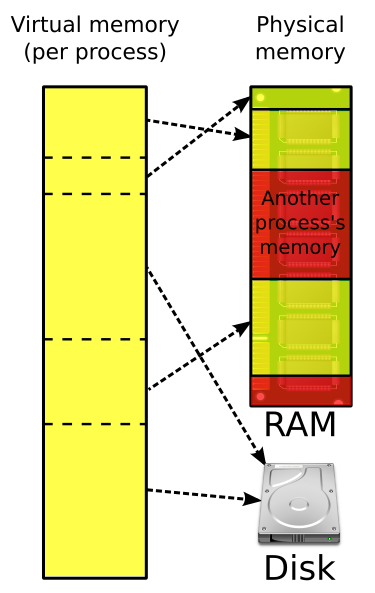

#### Quick recap

1. Datatypes
2. Variables
	1. Primitive
	2. Compound
3. Functions
4. Multi-file compilation
	1. Preprocessing directives
	2. Header files
	3. Linker
		1. Symbol resolution
		2. Relocation

---
#### Agenda
1. Virtual memory (OS env) 
2. Strings (C++)
---
#### Virtual memory
Quick experiment:
```cpp
int x = 10;
int *p = &x;
cout << long(p) << endl; // prints 140734008929212 ~140734 GB
return 0;
```
---
**Virtual memory** is a memory management technique that provides an "idealized abstraction of the storage resources that are actually available on a given machine which "creates the illusion to users of a very large (main) memory



---
##### Address Translation
With virtual addressing, the CPU accesses main memory by generating a virtual address (VA), which is converted to the appropriate physical address before being sent to the memory. The task of converting a virtual address to a physical
one is known as address translation.

---
##### Advantages of virtual memory
- It uses *main memory efficiently by treating it as a cache for an address space stored on disk*, keeping only the active areas in main memory, and transferring data back and forth between disk and memory as needed.
- It simplifies memory management by *providing each process with a uniform address space*. 
- It *protects the address space of each process* from corruption by other processes.
---
##### Related commands
```bash
# used to see, set, or limit the resource usage of the current user
ulimit -a
# physical memory stats
grep "Mem" /proc/meminfo
# MemTotal:       15728428 kB
# MemFree:         5499416 kB
# MemAvailable:    9727596 kB
# Virtual memory stats
cat /proc/meminfo | grep -e "Vmalloc"
# VmallocTotal:   34359738367 kB
# VmallocUsed:       87340 kB
# VmallocChunk:          0 kB
```
---
#### String literals
A **string literal** is a sequence of characters enclosed in double quotes (`"`). It is a constant array of characters that ends with a null character (`'\0'`), which indicates the end of the string.

```cpp
const char* str = "Hello, World!";
str[0] = "h" // not allowed

"Hello" + "World" // + operator doesnt work!
```
---
#### Char arrays
A **char array** is a basic array of characters that you can use to store a sequence of characters. Unlike string literals, a char array can be modified.
```cpp
char greeting[] = "Hello";
greeting[1] = 'H' // modifiable

```
---
#### std::string
`std::string` is a class provided by the C++ Standard Library that represents a dynamic sequence of characters. It is part of the `<string>` header and is much more flexible and powerful than raw string literals.

```cpp
// initialization
string greeting = "Hello";
greeting += " World!"
cout << greeting << endl; // "Hello World!"
```

---

| **Feature**           | **String Literal** (`"Hello"`)       | **Char Array** (`char greeting[] = "Hello"`) | **std::string** (`std::string greeting = "Hello"`)                              |
| --------------------- | ------------------------------------ | -------------------------------------------- | ------------------------------------------------------------------------------- |
| **Type**              | `const char[]`                       | `char[]`                                     | `std::string`                                                                   |
| **Null-Terminated**   | Yes (automatically)                  | Yes (if initialized with a string literal)   | No (internally managed, but compatible with C-style strings using `c_str()`)    |
| **Mutable**           | No                                   | Yes                                          | Yes                                                                             |
| **Memory Management** | Fixed at compile-time, read-only     | Fixed at compile-time, but mutable           | Dynamically managed, resizes automatically                                      |
| **Usability**         | Limited                              | Requires careful management                  | High, with many built-in functions                                              |
| **Memory Storage**    | Typically stored in read-only memory | Stack (if local)                             | Heap (dynamic allocation)                                                       |

---
##### Ways to Initialise strings(1)

| Code                 | Description                                                   |
| -------------------- | ------------------------------------------------------------- |
| `string s1`          | Default initialization; `s1` is the empty string.             |
| `string s2(s1)`      | `s2` is a copy of `s1`.                                       |
| `string s2 = s1`     | Equivalent to `s2(s1)`, `s2` is a copy of `s1`.               |
| `string s3("value")` | `s3` is a copy of the string literal, not including the null. |

---
##### WAYS TO INITIALISE STRINGS(2)

| Code                  | Description                                                        |
| --------------------- | ------------------------------------------------------------------ |
| `string s3 = "value"` | Equivalent to `s3("value")`, `s3` is a copy of the string literal. |
| `string s4(n, 'c')`   | Initialize `s4` with `n` copies of the character`'c'`.             |

---
##### String Functions

```c++
#include <iostream>
#include <string>
using namespace std;

int main() {
    // Initializing a string
    string str = "Hello, World!";

    // Length of the string
    cout << "Length of the string: " << str.length() << endl;

    // Accessing characters
    cout << "First character: " << str[0] << endl;
    cout << "Last character: " << str[str.length() - 1] << endl;

    // Substring
    string sub = str.substr(7, 5); // Starting from index 7, length 5
    cout << "Substring: " << sub << endl;

    // Find a substring
    size_t pos = str.find("World");
    if (pos != string::npos) {
        cout << "\"World\" found at index: " << pos << endl;
    } else {
        cout << "\"World\" not found" << endl;
    }

    // Replace a part of the string
    str.replace(7, 5, "Everyone"); // Replacing "World" with "Everyone"
    cout << "After replacement: " << str << endl;

    // Inserting a substring
    str.insert(7, "Beautiful "); // Inserting "Beautiful " at index 7
    cout << "After insertion: " << str << endl;

    // Erasing a part of the string
    str.erase(7, 10); // Erasing "Beautiful "
    cout << "After erasing: " << str << endl;

    // Converting to C-string (const char*)
    const char* cstr = str.c_str();
    cout << "C-string: " << cstr << endl;

    return 0;
}

```
---

#### References
1. Virtual Memory - Chapter 9 CSAPP
2. [Chapter 3. Strings, Vectors, and Arrays | C++ Primer, Fifth Edition](https://cpp-primer.pages.dev/book/029-chapter_3._strings_vectors_and_arrays.html)