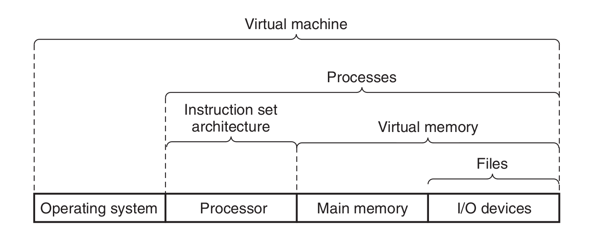
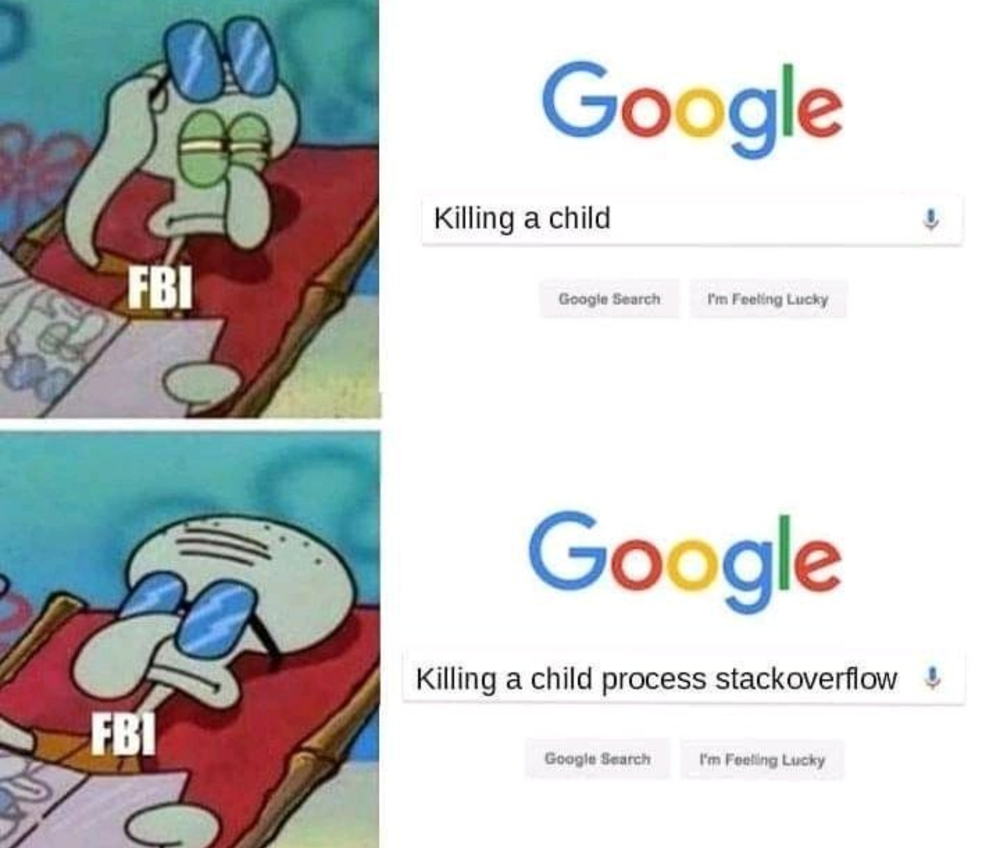

#### Working with commands(1)
A command can be one of four different things:
1. **An executable program** compiled binaries such as programs written in C/C++/Java  or programs written in scripting languages such as the shell, perl, python, ruby, etc.
2. A command **built into the shell** itself. 
3. **shell function**
4. **An alias.** Commands that we can define ourselves, built from other commands.
---
#### Working with commands(2)
How do you know more about commands?
1. `type`: type tells you whether command is a builtin or alias or an executable program
```bash
type echo
# output: echo is a shell builtin
type cp
# outputs: cp is /usr/bin/cp
type ls
# outputs: ls is aliased to `ls --color=auto'
```
2. `which` displays the path of the executable file of that program is located
3. `man` shows the paginated documentation called a manual or man page for the command.
---
#### OS abstractions

 

---
#### Processes(1) 
1. When a system starts up, the kernel initiates a few of its own activities as processes and launches a program called init. 
```bash
ps -ef | grep init
#outputs: 
#root           1       0  0 Jul22 ?        00:00:03 /sbin/init splash
```

3. init, in turn, runs a series of shell scripts (located in
/etc) called init scripts, which start all the system services.
```bash
ps h --ppid 1
# outputs:
# 475 ?        S<s    0:04 /lib/systemd/systemd-journald
# ...
```
---
#### Processes(2)
Process related commands 
1. `htop` – Display tasks
```bash
htop
# allows search
```

2. `ps`: Report a snapshot of current processes
```bash
ps -ef
```
3. `nohup`
```bash
nohup /usr/bin/vlc &
# runs a program without blocking the terminal, saves output to nohup.out instead of terminal
```

---

4. kill – Send a signal to a process
```bash
kill -SIGKILL $pid
```



---

#### GUI vs CLI(continued)

**What happens when you double click an icon on GUI?**
- **GUI Event Handling**: The desktop environment detects the double-click.
- **File Manager Interaction**: The file manager retrieves the desktop entry file for VLC(usually found in `/usr/share/applications`) and has `.desktop` extension.
- **Launching the Application**: The desktop environment executes the command specified in the desktop entry file.
- Service manager launches the vlc application
---
**What happens when you run the command from terminal?**

-  Shell parses the command and locates the VLC executable in SYSTEM path.
- Shell forks a new process and executes the VLC executable.
```bash
ps -ef | grep vlc
```
---

#### References
1. CSAPP,  Chapter 1
2. Linux Command Line, Chapter 11
