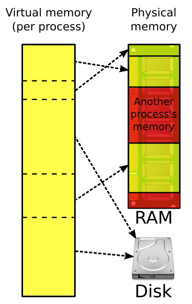
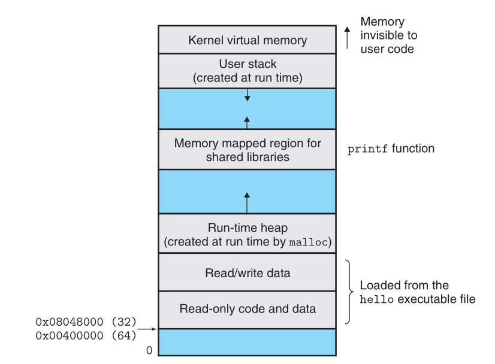

---
delivery date:
  - "[[2024-07-31]]"
  - "[[2025-07-31]]"
---

## Quick recap
1. Compilation process (Preprocessing -> Compilation -> Assembly phase -> linking)
2. C++ Input/Output (std::cout, std::cin, `>>` and `<<` operators)

# Agenda
1. Variables and Basic Types
2. Memory management
---

### Variables
A variable is a **named location that stores a value**. Each variable in C++ has a type.  
The type determines:   
- the size and layout of the variable’s memory
- the range of values that can be stored within that memory
- the set of operations that can be applied to the variable.
---

Data Types in C++ are mainly divided into 3 Types: 
1. **Primitive Data Types**: These data types are built-in or predefined data types and can be used directly by the user to declare variables. example: int, char, float, bool, etc. Primitive data types available in C++ are: 
2. **Derived Data Types**: Derived data types that are derived from the primitive or built-in datatypes are referred to as Derived Data Types. These can be of four types namely: 
3. **Abstract or User-Defined Data Types**: Abstract or User-Defined data types are defined by the user itself. Like, defining a class in C++ or a structure. C++ provides the following user-defined datatypes: 


Pic credit: Geeks for Geeks

| Datatype              | Description                                                                                                                                                                           | Size         | Range                     |
| --------------------- | ------------------------------------------------------------------------------------------------------------------------------------------------------------------------------------- | ------------ | ------------------------- |
| Integer               | The keyword used for integer data types is **int**.                                                                                                                                   | 4 bytes      | -2147483648 to 2147483647 |
| Character             | Character data type is used for storing characters. The keyword used for the character data type is **char**.                                                                         | 1 byte       | -128 to 127 or 0 to 255   |
| Boolean               | Boolean data type is used for storing Boolean or logical values. A Boolean variable can store either true or false. The keyword used for the Boolean data type is **bool**.           | N/A          | true or false             |
| Floating Point        | Floating Point data type is used for storing single-precision floating-point values or decimal values. The keyword used for the floating-point data type is **float**.                | 4 bytes      | N/A                       |
| Double Floating Point | Double Floating Point data type is used for storing double-precision floating-point values or decimal values. The keyword used for the double floating-point data type is **double**. | 8 bytes      | N/A                       |
| void                  | Void means without any value. void data type represents a valueless entity. A void data type is used for those functions which do not return a value.                                 | N/A          | N/A                       |
| Wide Character        | Wide character data type is also a character data type but this data type has a size greater than the normal 8-bit data type. Represented by **wchar_t**.                             | 2 or 4 bytes | N/A                       |


### Variable assignment
```c++
int sum = 0, value, // sum, value, and units_sold have type int
    units_sold = 0; // sum and units_sold have initial value 0
    
// ok: price is defined and initialized before it is used to initialize discount
double price = 109.99, discount = price * 0.16;
// ok: call applyDiscount and use the return value to initialize salePrice
double salePrice = applyDiscount(price, discount);
```

### Memory allocation of a program


---

#### Address space


---


| Memory Segment | Type of Variables                                           | Characteristics                                |
| -------------- | ----------------------------------------------------------- | ---------------------------------------------- |
| Stack          | - Local variables                                           | - Automatic allocation and deallocation        |
|                | - Function call frames                                      | - LIFO (Last In, First Out) order              |
|                | - Parameters                                                | - Limited size                                 |
|                | - Temporary variables                                       | - Exists only for the duration of the function |
| Heap           | - Dynamically allocated variables (using `new` or `malloc`) | - Manual allocation and deallocation           |
|                | - Objects and arrays allocated at runtime                   | - Can grow as needed                           |
|                |                                                             | - Fragmentation possible                       |
| Program Data   | - Global variables                                          | - Initialized at program start                 |
| (Data Segment) | - Static variables                                          | - Divided into initialized and uninitialized   |
|                | - Constants                                                 | - Global lifetime                              |
|                | - Strings                                                   | - Accessible throughout the program            |
| Code Segment   | - Executable instructions                                   | - Read-only                                    |
| (Text Segment) |                                                             | - Contains compiled code                       |


#### Default values

| Variable Type          | Memory Segment | Default Initialization                     |
|------------------------|----------------|--------------------------------------------|
| Local Variables        | Stack          | Undefined (contains garbage values)        |
| Global Variables       | Data Segment   | Zero-initialized (0 for basic types)       |
| Static Variables       | Data Segment   | Zero-initialized (0 for basic types)       |
| Dynamically Allocated  | Heap           | Undefined (contains garbage values)        |
| Built-in Types (int, float, etc.) | Stack/Heap | Undefined (contains garbage values)        |
| Built-in Types (Global/Static) | Data Segment | Zero-initialized (0 for basic types)       |
| User-Defined Types     | Stack/Heap     | Default constructor (if provided)          |

#### Segmentation fault experiment
```c++
#include <iostream>

void causeSegmentationFault(int depth) {
    // function calls itself by appending the argument
    // note there is no stopping condition in the recursion, hence it will keep on calling itself forever.
    // thereby expanding stack
    std::cout << "Recursion depth: " << depth << std::endl;
    causeSegmentationFault(depth + 1); // Recursive call with increased depth
}

int main() {
    causeSegmentationFault(1); // Start the recursion
    return 0;
}

```
---
#### Related bash commands
```bash

# return the maximum memory available to program stack(in KB)
ulimit -s 

# return the maximim heap memory available to a program
ulimit -v

# set maximum heap memory to 2GB
ulimit -v 2097152
```
```

### How to choose data types?
- Use an unsigned type when you know that the values cannot be negative.
- Use `int` for integer arithmetic. `short` is usually too small and, in practice, `long` often has the same size as `int`. If your data values are larger than the minimum guaranteed size of an `int`, then use `long long`.
- Do not use plain `char` or `bool` in arithmetic expressions. Use them _only_ to hold characters or truth values.
- Use `double` for floating-point computations; `float` usually does not have enough precision, and the cost of double-precision calculations versus single-precision is negligible.
```


# Type conversion
```c++
bool b = 42;            // b is true
int i = b;              // i has value 1
i = 3.14;               // i has value 3
double pi = i;          // pi has value 3.0
unsigned char c = -1;   // assuming 8-bit chars, c has value 255
signed char c2 = 256;   // assuming 8-bit chars, the value of c2 is undefined
```

# References
1. [C++ datatypes - Geeks4Geeks](https://www.geeksforgeeks.org/cpp-data-types)
2. Memory Management (CSAPP - Section 1.7.3)
3. [Primitive Builtin types - CPP-Primer ](https://cpp-primer.pages.dev/book/021-2.1._primitive_builtin_types.html)
4. [Variables - CPP-Primer ](https://cpp-primer.pages.dev/book/022-2.2._variables.html)
