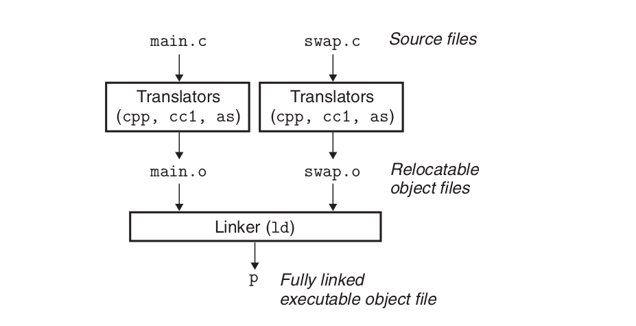
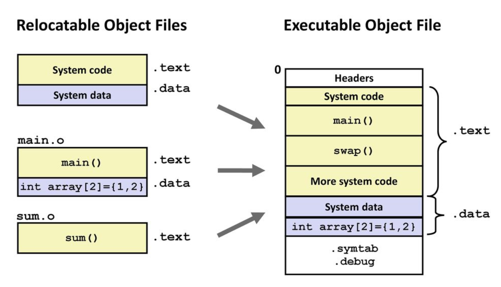

---
delivery date:
  - 2024-08-08
  - "[[2025-08-12]]"
---
### Quick recap
1. Compound types
	1. Variables have name, value and address
	2. References are aliases for existing variables
	3. Pointers are variables that store addresses of other variables
2. Functions
	1. return type
	2. parameters
	3. function body
3. Function overloading: Define different behaviour of a program based on different parameters
---
### Agenda
1. Multi file compilation

---

#### How does multi compilation works?
1. **Preprocessor** processes each source file and act upon preprocessor directives(hash directives). (test.cpp => test.i)
2. **Compiler** takes in the resultant source file and compile it to assembly code. (test.i => test.s)
3. **Assembler** takes in the assembly file and convert it into a relocatable object code. (test.s => test.o)
4. **Linker** takes multiple object files and generate a single executable file (test.o => test.out)

---

Linker positioned in compilation process.  
Pic credits: CSAPP

---

#### Linker
Linker  perform two main tasks:  
**Symbol resolution:** Object files define and reference symbols. The purpose of symbol resolution is to *associate each symbol reference with exactly one symbol definition.*  
**Relocation:** Compilers and assemblers generate code and data sections that start at address 0. The linker relocates these sections by associating a memory location with each symbol definition, and then modifying all of the references to those symbols so that they point to this memory location.

---

Relocation  
Pic credits: CSAPP

---
#### declaration vs definition vs initialisation vs assignment

**Declaration**: Introduces the name of a variable, function, class, etc., and its type, without allocating memory or providing an implementation.  
**Definition**: Provides the actual implementation or allocation of memory for the declared entity.  
**Initialization**: Assigning an initial value to a variable at the time of its definition.  
**Assignment:** replaces existing value of a variable with a new value

---
```c++
extern int globalVar; //declaration of a variable 

int add(int, int); //declaration of a function
int globalVar; //definition of a variable with default assignment

// definition of a function
int add(int a, int b) {
    return a + b;
}

//definition with initialization
int globalVar = 5;
// assignment
globalVar = 5;
```
---
#### header files vs source files

| Aspect          | Header Files (`.h`, `.hpp`)                                                                  | Source Files (`.cpp`, `.cc`, `.cxx`)                                                         |
| --------------- | -------------------------------------------------------------------------------------------- | -------------------------------------------------------------------------------------------- |
| **Purpose**     | Declarations of functions, classes, and variables. Provides interfaces and API definitions.  | Definitions and implementations of functions and classes. Contains the actual code logic.    |
| **Compilation** | Included in source files using `#include` directive. Not compiled independently.             | Compiled independently into object files (`.o`, `.obj`).                                     |
| **Dependency**  | Can include other header files and itself included by multiple source files.                 | Depends on header files for declarations and can include other header files.                 |
| **Reusability** | Promotes code reuse and modularity by providing common interfaces for multiple source files. | Implements the reusable logic defined in header files.                                       |
| **Visibility**  | Provides an interface for other files to use without revealing the implementation details.   | Contains implementation details that are not exposed to other parts of the program directly. |


---
#### Directives
Hash directives, also known as preprocessor directives, are instructions that are processed by the preprocessor before the actual compilation of the code begins.

| Directive                    | Purpose                                                                |
| ---------------------------- | ---------------------------------------------------------------------- |
| #include                     | Links a header file in the source code.                                |
| #define                      | Creates a symbolic or macro constant.                                  |
| #undef                       | Deletes a macro that has already been defined.                         |
| #ifdef / #ifndef             | Compilation that is conditional on the presence or absence of a macro. |
| #if / #elif / #else / #endif | Compilation that is conditional based on some expression.              |
| #error                       | Halts the compilation process and produces an error notice.            |
| #warning                     | During compilation, a warning notice is shown.                         |
| #pragma                      | Provide the compiler specific instructions.                            |

---
#### sharing variables across files

**`extern` Keyword**:
- Used to declare a variable or function in a different file, indicating that its definition exists elsewhere.
- Helps in sharing global variables across multiple files.

The `extern` keyword establishes external linkage, making the variable or function accessible across different translation units.

---
#### Example code
Project structure
```css
project/
├── main.cpp
├── math_functions.h
└── math_functions.cpp

```

---
math_functions.h

```c++
  
// execute below code only when MATH_FUNCTIONS_H is not defined
#ifndef MATH_FUNCTIONS_H

// define MATH_FUNCTIONS_H so that below code is only executed once
#define MATH_FUNCTIONS_H


int add(int, int);
int subtract(int, int);

#endif
```

math_functions.cpp
```c++
#include "math_functions.h" // contains function declaration

int add(int a, int b) { // function definition verified against declaration
    return a + b;
}

int subtract(int a, int b) { // function definition verified against declaration
    return a - b;
}

```
---
main.cpp
```c++
#include <iostream>
#include "math_functions.h"

extern int globalVar; // Assume globalVar is defined in another source file

int main(int argc, char* argv[]) {
	if(argc!=3){
		print("Please enter 2 numbers.")
		return 1;
	}
	int x = std::stoi(argv[1]);
	int y = std::stoi(argv[2]);
    std::cout << "Addition: " << add(x, y) << std::endl;
    std::cout << "Subtraction: " << subtract(x, y) << std::endl;
    return 0;
}

```
---

##### Compilation
```bash
# Compile `math_functions.cpp`
g++ -c math_functions.cpp -o math_functions.o
# Compile `main.cpp`
g++ -c main.cpp -o main.o
# Link the object files
g++ main.o math_functions.o -o my_program

```
---

### References
1. [Section 2.2.2 Variable Declarations and Definitions](https://cpp-primer.pages.dev/book/022-2.2._variables.html)
2. [C++ Preprocessor And Preprocessor Directives - GeeksforGeeks](https://www.geeksforgeeks.org/cpp-preprocessors-and-directives)
3. Chapter 7: Linking(7.1-7.8) - CSAPP


